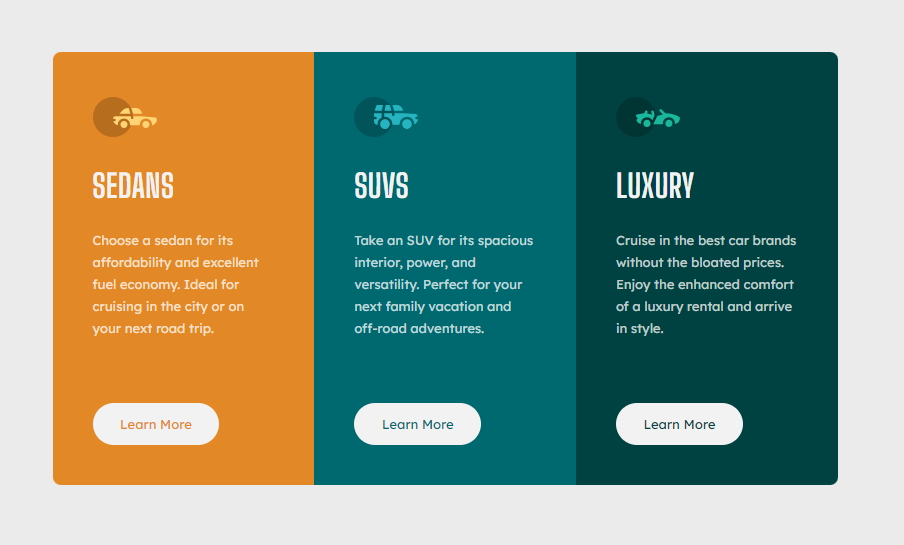

# Frontend Mentor - 3-column preview card component solution

---

This is a solution to the [3-column preview card component challenge on Frontend Mentor](https://www.frontendmentor.io/challenges/3column-preview-card-component-pH92eAR2-).

### Screenshot

### Links

- Solution URL: 
- Live Site URL: 

## My process

### Built with

- Semantic HTML5 markup
- SCSS custom properties
- Flexbox
- CSS Grid
- Mobile-first workflow
- Media Queries & Keyframes
- Vanilla JavaScript

Netlify used for deployment.

## Author

- Website - [https://www.andreferreiradev.com/](https://www.andreferreiradev.com/)
- Frontend Mentor - [https://www.frontendmentor.io/profile/Namonaki0](https://www.frontendmentor.io/profile/Namonaki0)
- Github - [https://github.com/Namonaki0](https://github.com/Namonaki0)
